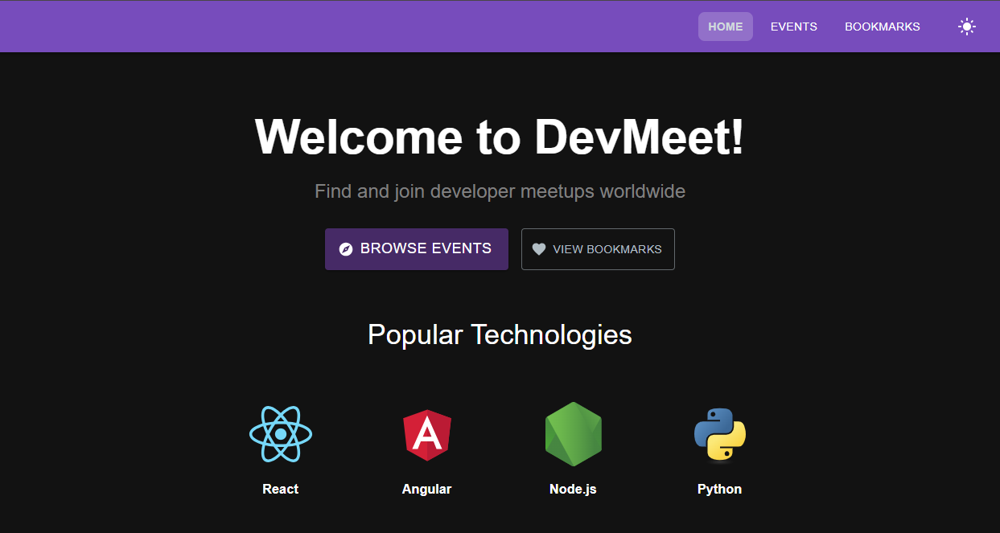
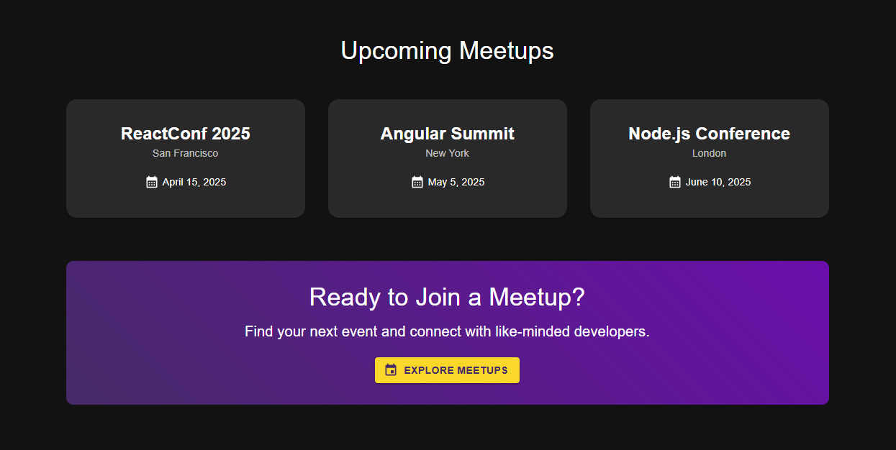
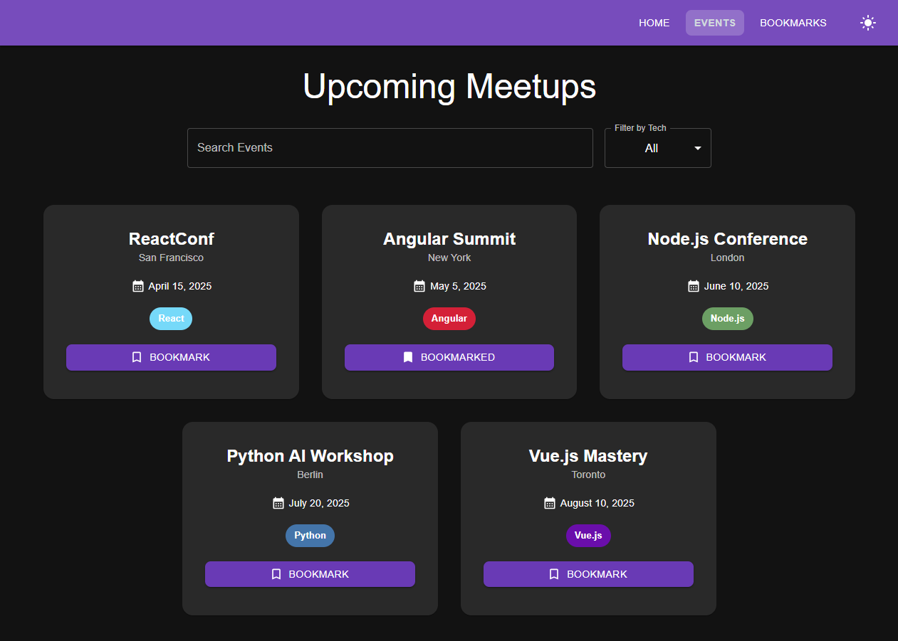
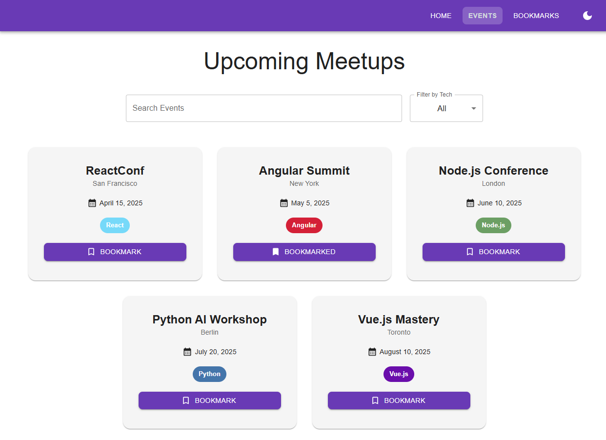
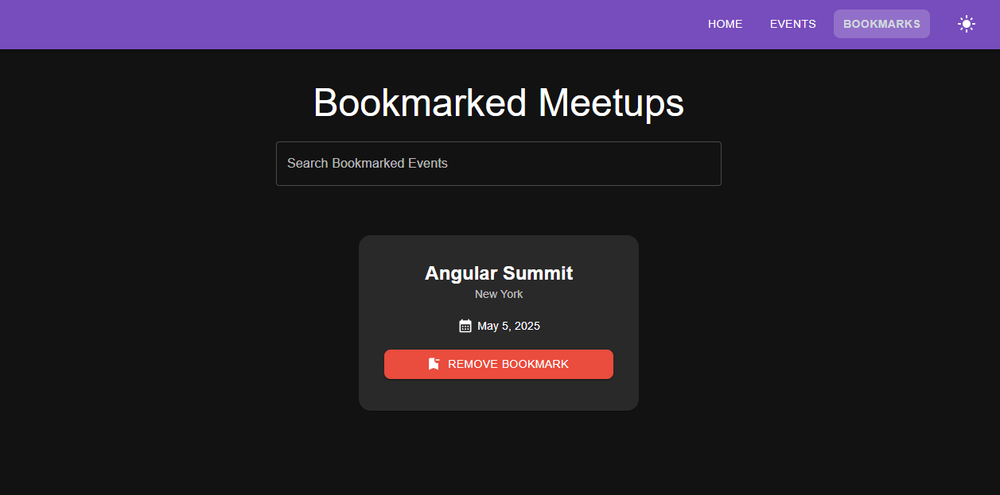

# 🚀 DevMeet - Meetup Manager

A **React & Material UI** powered web app for discovering, bookmarking, and managing **tech meetups**.  
Users can **search, filter, and save events**, ensuring they never miss an important tech gathering.







## 🌟 Features

✅ **Event Listing** – Browse upcoming tech meetups  
✅ **Bookmark Events** – Save events for later  
✅ **Search & Filter** – Quickly find relevant meetups  
✅ **Dark Mode Support** – Seamless theme switching  
✅ **Responsive Design** – Works on mobile & desktop  
✅ **Persistent Storage** – Bookmarks saved in `localStorage`

## 🛠️ Tech Stack

- **Frontend:** React, TypeScript
- **UI Library:** Material UI
- **Animations:** Framer Motion
- **State Management:** React Hooks
- **Storage:** Local Storage

## 🔧 Installation & Setup

1️⃣ **Clone the Repository**

```sh
git clone https://github.com/adrianadelazzari/dev-meet.git
cd dev-meet
```

### 2️⃣ Install Dependencies

```sh
npm install
```

### 3️⃣ Run the Development Server

```sh
npm start
```

Now, open http://localhost:3000/ in your browser.

### 📜 License

This project is open-source under the [MIT License](https://mit-license.org/).
